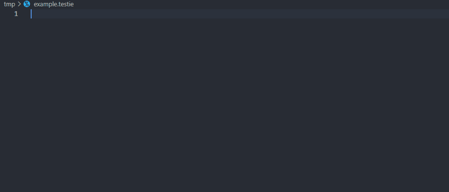
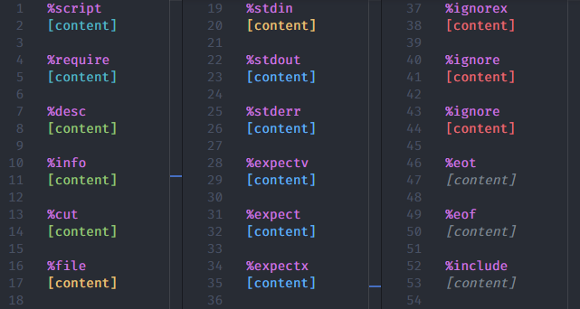
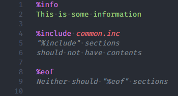
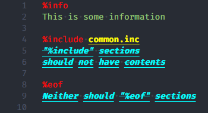

# Click Language Features

## Build & Pack VSIX file

```sh
cd /path/to/click-language-features
npm install # Install dependencies
npx vsce package # Compile and pack
```

Output file is named `click-language-features-<version>.vsix`.

If you are working on a remote project over SSH, you should upload the .vsix file to the remote side.

## Installation

1. Open your project that uses click in VSCode (over SSH if necessary).
2. Open command pannel and execute command "Extensioins: Install from VSIX..."
3. Select the previously packed .vsix file.

## Click Configuration Language Server

[To be implemented]

## Testie Language Server

### Features Overview

- [x] Completion
- [ ] Diagnostics
- [ ] Hover
- [x] Semantic Tokens
- [ ] Folding Range
- [ ] Document Symbol

### Completion

Support completion for section names and section arguments.



### 🚧 Diagnostics

### 🚧 Hover

### Semantic Tokens

#### Preview



#### Customize colors

To tune the syntax highlighting colors, use `editor.semanticHighlighting.enabled` in your [`settings.json`](https://code.visualstudio.com/docs/getstarted/settings). For more information, refer to [VSCode Documentation](https://code.visualstudio.com/docs/getstarted/themes#_editor-semantic-highlighting).

All the semantic tokens used in testie files along with their modifiers:

| Item | Token Type | Token Modifiers |
| --- | --- | --- |
| Section name | `keyword` | / |
| Section args | `parameter` | / |
| "%script" contents<br/>"%require" contents | `enumMember` | / |
| "%info" contents<br/>"%desc" contents<br/>"%cut" contents | `string` | / |
| "%include" contents<br/>"%eot" contents<br/>"%eof" contents<br/>garbage | `comment` | `deprecated` |
| "%file" contents<br/>"%stdin" contents | `interface` | / |
| "%expect" contents<br/>"%expectv" contents<br/>"%expectx" contents<br/>"%stdout" contents<br/>"%stderr" contents | `method` | / |
| "%ignore" contents<br/>"%ignorev" contents<br/>"%ignorex" contents | `property` | / |

Example:

```json
// settings.json:
{
	"editor.semanticTokenColorCustomizations": {
		"rules": {
			"keyword": "#FF0000",
			"parameter": {
				"foreground": "#FFFF00",
				"italic": false,
				"bold": true,
				"underline": true,
				"strikethrough": false
			},
			"comment.deprecated": {
				"foreground": "#00FFFF",
				"fontStyle": "italic bold underline strikethrough"
			}
		}
	}
}
```

| Before | After |
| :---: | :---: |
| | |

### 🚧 Folding Range

### 🚧 Document Symbol
